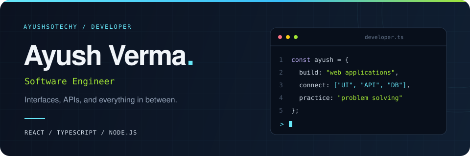

  

  
  &nbsp;
  
  &nbsp;
  

  <a href="#about">About</a> &nbsp; / &nbsp;
  <a href="#stack">Stack</a> &nbsp; / &nbsp;
  <a href="#selected-work">Selected work</a> &nbsp; / &nbsp;
  <a href="#problem-solving">Problem solving</a>

 

## About

Hey, I'm **Ayush** — a **Software Engineer** building web applications with **React, TypeScript, and Node.js**.

**Delhi Technological University** · Full-stack development · Problem solving

My projects span coding platforms, food ordering, and healthcare workflows. I enjoy connecting the pieces: the interface people use, the API behind it, and the data that makes it work.

- **On the frontend:** React interfaces, routing, and interactive experiences.
- **On the backend:** Express APIs, authentication, and database-backed applications.
- **Beyond the app:** data structures, algorithms, and problem solving on [LeetCode](https://leetcode.com/u/ayushsotechy/).

 

## Stack

  

| Area | Technologies used in my projects |
| :--- | :--- |
| **Languages** | JavaScript · TypeScript |
| **Frontend** | React · Tailwind CSS · Vite |
| **Backend & data** | Node.js · Express · PostgreSQL · MongoDB · Prisma |
| **Tools & integrations** | Git · Docker · JWT · WebSockets |

 

## Selected work

### 01 / Heapspace
**A place to practice, run, and submit code.**

A coding platform with a problem set, browser-based editor, code execution, and submission workflows. Built with a TypeScript frontend and backend, with PostgreSQL through Prisma.

`React` `TypeScript` `Node.js` `Express` `PostgreSQL` `Prisma`

[View repository ↗](https://github.com/ayushsotechy/heapspace)

---

### 02 / FlavorFeed
**From finding food to placing an order.**

A food-ordering application with restaurant pages, a cart, order history, and a partner dashboard. Includes authentication and Razorpay payment integration.

`React` `JavaScript` `Node.js` `Express` `Tailwind CSS` `Razorpay`

[View repository ↗](https://github.com/ayushsotechy/FlavorFeed)

---

### 03 / Arogya Mitra
**Patient and hospital workflows, connected.**

A hospital-management application with separate patient and admin interfaces, appointment booking, doctor management, and role-based access.

`React` `Node.js` `Express` `MongoDB` `JWT` `Cloudinary`

[View repository ↗](https://github.com/ayushsotechy/Arogya_Mitra)

 

## Problem solving

Alongside building applications, I practice data structures and algorithms on **LeetCode**.

  

 

## GitHub activity

  

 

  <b>Build something useful. Understand how it works. Make it better.</b>
    
  <a href="https://www.linkedin.com/in/ayush-verma-7334a8194/">Connect on LinkedIn</a>
  &nbsp; · &nbsp;
  <a href="https://github.com/ayushsotechy?tab=repositories">Explore my repositories</a>
  &nbsp; · &nbsp;
  <a href="https://leetcode.com/u/ayushsotechy/">Find me on LeetCode</a>

<!-- Live cards are provided by LeetCode Stats Card and GitHub Readme Stats. -->
